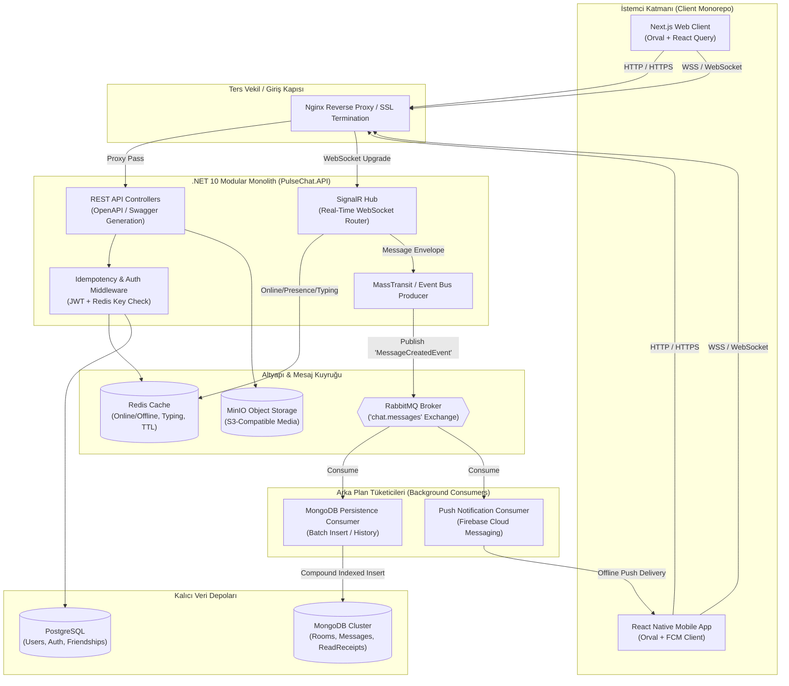
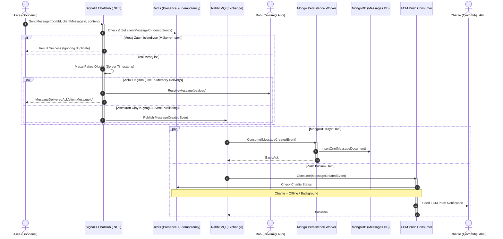
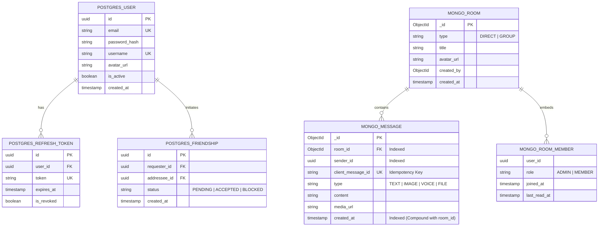
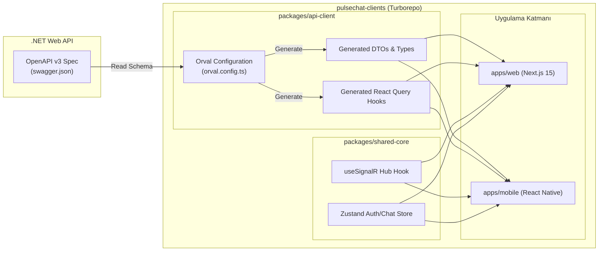

# PulseChat - Proje Teknik Dokümantasyonu ve Mimari Tasarım Raporu

**Proje Adı:** PulseChat (Gerçek Zamanlı Mesajlaşma Sistemi)  
**Hedef Ölçek:** 1.000 – 2.000 Eşzamanlı Aktif Kullanıcı (Concurrent Users)  
**Geliştirme Metodolojisi:** Spec-Driven Development (Spesifikasyon Odaklı Geliştirme) & AI Governance (Agent Denetimi)[cite: 16]

---

## 1. Yönetici Özeti ve Projenin Amacı
Bu proje; kurumsal standartlara tam uyumlu, modern, yüksek eşzamanlılık kapasitesine sahip ve ölçeklenebilir bir gerçek zamanlı mesajlaşma platformudur[cite: 1, 2]. Sistemin öncelikli odağı, 1.000 ila 2.000 aktif kullanıcı arasında milisaniyeler düzeyinde düşük gecikmeli (low latency) anlık mesajlaşma, oda/grup yönetimi, çevrimiçi durum takibi ve asenkron bildirim dağıtımı sağlamaktır[cite: 1, 2]. Sistem gereksiz karmaşıklıklardan (over-engineering) arındırılmış, yalnızca açık kaynaklı ve ücretsiz teknolojiler üzerine inşa edilmiştir[cite: 1].

---

## 2. Mimari Prensipler ve Tasarım Desenleri

### 2.1. Sistem Mimarileri
* **Modular Monolith:** Sistem tek bir çalıştırılabilir .NET Core Web API projesi çatısı altında, mantıksal ve fiziksel olarak birbirinden izole modüller (Auth, Chat, Notification, Media) şeklinde kurgulanmıştır[cite: 1, 4, 13]. Mikroservis operasyonel maliyetini ve ağ gecikmesini engeller[cite: 4, 11, 13].
* **Event-Driven Architecture (EDA):** Mesaj gönderme eylemi HTTP/Socket döngüsünü kilitlemez[cite: 1, 6]. Mesaj SignalR Hub'a ulaştığı anda doğrudan RabbitMQ olay kuyruğuna aktarılır; kalıcı veritabanı kaydı ve bildirim dağıtımı arka plan worker'ları tarafından asenkron olarak tüketilir[cite: 1, 2].
* **Vertical Slice & CQRS:** Modüller dikey dilimlere (Vertical Slices: `SendMessage`, `GetHistory`, `MarkAsRead`) ayrılmıştır[cite: 1, 11]. Komut (Command) ve Sorgu (Query) sorumlulukları kod seviyesinde izole edilmiştir[cite: 1, 19].
* **Separation of Concerns (SoC) & Clean Architecture:** Dış katmanlar iç katmanları bilir, ancak çekirdek iş mantığı hiçbir dış aracı (MongoDB, RabbitMQ, SignalR) doğrudan tanımaz; bağımlılıklar arayüzler (Interfaces) üzerinden tersine çevrilir[cite: 1, 11, 13].
* **Contract-First & Automated Code Generation (Orval):** Frontend tarafında manuel custom hook, fetch veya axios istekleri yazılmaz[cite: 2, 16]. .NET Web API tarafından dışa açılan OpenAPI (Swagger) şeması okunarak, tüm React Query hook'ları ve TypeScript tipleri `Orval` aracılığıyla otomatik üretilir[cite: 2].

### 2.2. Uygulanan Tasarım Desenleri (Design Patterns)
* **Publish-Subscribe (Pub/Sub) Deseni:** RabbitMQ üzerinde kurulan `Exchange` ve `Queue` yapısıyla mesajlar birden fazla tüketiciye (MongoDB Worker, FCM Push Worker) kayıpsız dağıtılır[cite: 1, 2, 11].
* **Cache-Aside Deseni:** Kullanıcıların online/offline durumu veya okunmamış mesaj sayaçları önce Redis üzerinde aranır (Cache Hit)[cite: 3, 4]. Veri yoksa veya ilk kez yükleniyorsa DB'den okunup Redis'e yazılır (Cache Miss)[cite: 3, 4].
* **Result Pattern:** API ve Hub yanıtlarında çıplak veri veya doğrudan `throw new Exception` fırlatmak yerine; `isSuccess`, `data`, `errorCode` ve `message` alanlarını taşıyan tip güvenli (type-safe) generic bir `Result<T>` sarmalayıcısı kullanılır[cite: 10, 15, 16].
* **Idempotency Deseni (Mükerrerlik Koruması):** Mobil ağlarda sinyal kopup tekrar bağlandığında istemci aynı mesajı iki kez atabilir[cite: 19]. İstemcinin ürettiği benzersiz `clientMessageId` (GUID), Redis üzerinde kontrol edilerek aynı mesajın mükerrer işlenmesi engellenir[cite: 19].
* **Centralized Exception Handling & Pipeline Behaviors:** Kodun içine `try-catch` blokları yığmak yerine, tüm hatalar küresel bir middleware veya pipeline behavior ile yakalanarak tek bir standart JSON formatına dönüştürülür ve merkezi loglama sistemine iletilir[cite: 10, 16].

---

## 3. Teknoloji Yığını ve Karar Matrisi

| Mimari Katman | Seçilen Teknoloji | Görev ve Sorumluluk | Seçilme Gerekçesi |
| :--- | :--- | :--- | :--- |
| **Backend API** | .NET 10 / ASP.NET Core | İş mantığı, WebSocket hub yönetimi, REST API servisleri ve OpenAPI üretimi[cite: 7, 14]. | Kurumsal şirket standardı, yüksek thread performansı ve kurumsal mimari desteği[cite: 1, 7, 14]. |
| **Canlı İletişim** | ASP.NET Core SignalR | WebSockets üzerinden çift yönlü gerçek zamanlı veri akışı[cite: 6]. | Ek sunucu maliyeti olmadan oda/grup ve bağlantı yönetimini yerleşik çözmesi[cite: 6]. |
| **Önyüz (Web)** | Next.js (React / TS) | Web sohbet arayüzü, oturum yönetimi[cite: 4, 7, 14]. | Bileşen modülerliği, hızlı render ve modern kullanıcı deneyimi[cite: 4, 7, 14]. |
| **Mobil İstemci** | React Native | iOS ve Android çapraz platform sohbet istemcisi[cite: 5]. | Ortak JS/TS ekosistemi ve yerel cihaz performansı[cite: 5]. |
| **API Client & Hooks** | Orval (Codegen) | OpenAPI şemasından otomatik React Query hook'ları ve DTO üretimi[cite: 2]. | Manuel fetch/hook yazımını bitirir, API değişikliklerinde compile-time tip güvenliği sağlar[cite: 2, 16]. |
| **Kod Kalitesi & Format** | ESLint & Prettier | Statik kod analizi, linting kuralları ve otomatik kod biçimlendirme[cite: 1, 6, 14]. | Ekip kodlama standardı, runtime hatalarını önleme ve homojen kod tabanı[cite: 1, 6, 14]. |
| **CI/CD & Otomasyon** | GitHub Actions | Lint, tip kontrolü, build, test koşumu ve sunucuya otomatik deployment[cite: 2, 3, 5]. | Hatasız entegrasyon, PR kontrolleri ve güvenli ortam değişkeni (Secrets) yönetimi[cite: 2, 3, 5]. |
| **Mesaj Veritabanı** | MongoDB | Mesaj geçmişi, sohbet odaları ve doküman kayıtları[cite: 1]. | Ağır yazma (heavy-write) dayanıklılığı, esnek şema ve bileşik indeksleme[cite: 14]. |
| **İlişkisel Veritabanı** | PostgreSQL | Kullanıcı kimlikleri, şifre hash'leri ve yetkiler[cite: 1, 4, 8]. | ACID garantisi, açık kaynak ve EF Core ile kusursuz uyum[cite: 1, 4, 8]. |
| **Mesaj Kuyruğu** | RabbitMQ | Asenkron olay dağıtımı (yazma ve bildirim worker'ları)[cite: 1, 2, 11]. | Gevşek bağlılık (loose coupling), güvenilir teslimat (ACK) ve sıfır kayıp garantisi[cite: 1, 2, 11]. |
| **Önbellek & Durum** | Redis (Docker) | Online/offline durumları, typing bildirimleri ve unread count[cite: 2, 3, 6]. | Milisaniyelik bellek içi hız ve veritabanı okuma yükünü sıfırlama[cite: 2, 3, 6]. |
| **Medya Depolama** | MinIO (Self-Hosted) | Görsel, ses kaydı ve dosya saklama (S3 Uyumlu)[cite: 1, 2, 10]. | Ücretsiz, açık kaynak nesne depolama, veritabanını şişirmeme[cite: 1, 2, 10]. |
| **Push Bildirim** | Firebase (FCM) | Mobil uygulama arka plandayken anlık bildirim iletme. | Tamamen ücretsiz, sektör standardı mobil bildirim altyapısı. |

---

## 4. Depo, CI/CD ve Kalite Güvence Stratejisi

### 4.1. Multi-repo Yapısı
* `pulsechat-backend`: .NET 10 API, MassTransit/RabbitMQ tüketicileri, EF Core ve MongoDB sürücüsü[cite: 1, 2, 7].
* `pulsechat-clients`: Monorepo (Turborepo) çatısı altında `apps/web` (Next.js), `apps/mobile` (React Native) ve OpenAPI çıktısını barındıran `packages/api-client`[cite: 2, 3, 10].

### 4.2. Statik Kod Kalite Hattı (ESLint & Prettier)
* Her iki istemcide ve backend'de kodlama kuralları kilitlenmiştir[cite: 1, 6, 14].
* **Temel Kural:** Elle tek bir REST API fetch/axios fonksiyonu yazılamaz; Orval tarafından üretilen modeller ve kancalar tüketilir[cite: 1, 2, 14].

### 4.3. GitHub Actions Pipeline
* **Pull Request Aşaması:** ESLint denetimi, Prettier format kontrolü, TypeScript tip doğrulaması (`tsc --noEmit`) ve Unit Test koşumu[cite: 1, 2, 5]. Hata varsa merge kilitlenir.
* **Deploy Aşaması:** Docker imajı inşası, GitHub Secrets enjeksiyonu ve prod sunucusuna otomatik servis yenileme[cite: 2, 3, 5].

---

## 5. Sistem ve Mimari Diyagramları

### 5.1. Sistem Mimarisi Diyagramı (System Architecture)

### 5.2. Mesaj Gönderim Sıralama Diyagramı (Sequence Diagram)

### 5.3. Veritabanı ve Doküman Şeması (ER & Document Diagram)

### 5.4. İstemci Monorepo ve Kod Üretim Hattı (Client Architecture)
